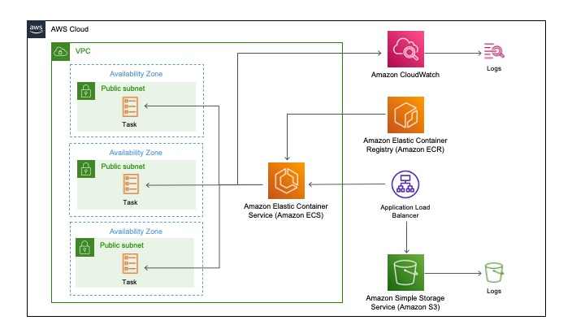

# DevOps Challenge

This repo contains the infrastructure to host a scalable website containing some text and an image.

The infrastructure utilises AWS resources to host the website, along with the use of Docker.

An Nginx docker image was built with a custom HTML, and stored in Elastic Container Registry (ECR).

The website is hosted using Elastic Container Service (ECS) Fargate, pulling the latest image from ECR. The Virtual Private Cloud (VPC) is created with 3 public subnets in 3 separate availability zones for high availability. An Application Load Balancer (ALB) distributes the traffic to each of the availability zones as the application scales. A health check has been created for the ALB so traffic is only routed to the heathly targets.

## Architecture Diagram

## Monitoring
The containers in the tasks send log information to CloudWatch logs to monitor the health and performance of the application.
Access logs are written to S3 which captures detailed information about the requests made to the Application Load Balancer.

## Scaling
The scalability for this application is achieved by using autoscaling to increase or decrease the desired count of tasks in the ECS service. The trigger for this is if the CPU or the Memory consumption increases to above 80%. This is currently configured to reach a max task size of 10.

## Security
Security groups have been configured for the ALB and for the ECS service. Only inbound traffic to port 80 is allowed on the ALB and then subsequently, the ECS service.

## Automation
A GitHub Actions deployment pipeline has been created to implement CI/CD practices. On creation of a PR to the main branch, a workflow is automatically triggered to format, initialise, and validate the code. A plan is subsequently generated and posted as a comment on the PR.
Once the PR is merged, the apply is triggered.
